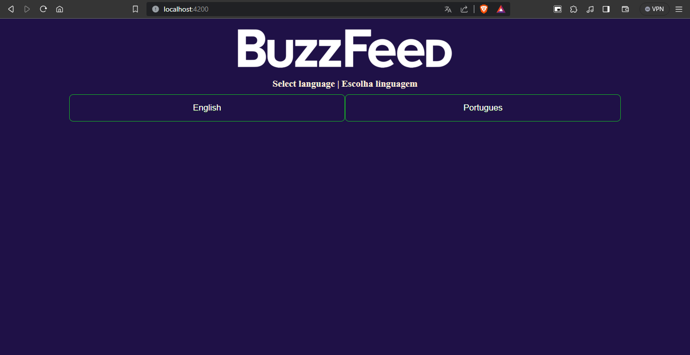
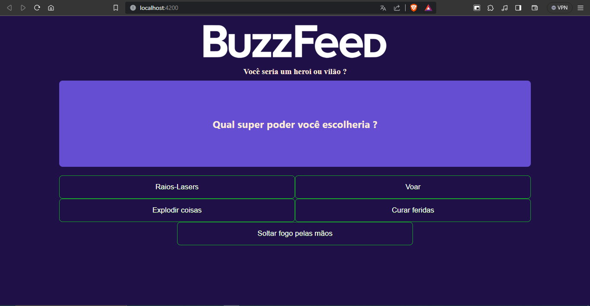
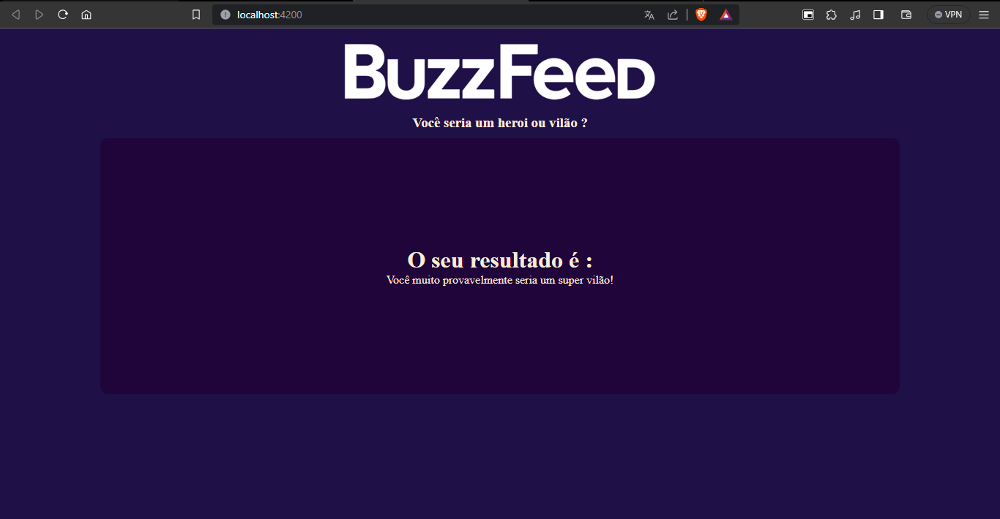

# Angular-BuzzFeed-Clone
Clone of the BuzzFeed website made in a Angular bootcamp at DIO.

## Quizz

Are you a Super Hero or a Super Villain, this experimental buzzfeed quizz clone knows.
It was developed with Angular framework and its fed by a json source with all responses.

Firs select a language :

Imma go with portuguese because i am brazilian, then this is what the homepage should look like :

make your choices and the final result is reveals your interior tendencies :

## How to run

Inside this directory run `cd web-app` to open the front end project directory.

Then run `ng serve` for a dev server. Navigate to `http://localhost:4200/`. The application will automatically reload if you change any of the source files.

